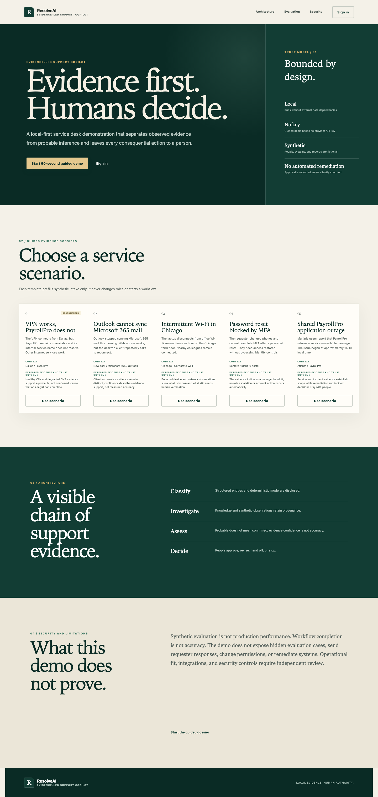

# ResolveAI

[](https://github.com/sameerhashmiii/ResolveAI/actions/workflows/ci.yml)
[](https://github.com/sameerhashmiii/ResolveAI/actions/workflows/codeql.yml)
[](LICENSE)

ResolveAI is a portfolio demonstration of an evidence-backed IT support workflow. It combines ticket intake, deterministic or optionally hosted AI assistance, bounded investigation, knowledge retrieval, probable-cause assessment, and explicit human approval. It is a non-production reference application, not an autonomous support system.

> **Privacy warning:** the checked-in deployment is a single-tenant local demo. Do not enter real personal, customer, credential, security-sensitive, or confidential data. It has no tenant isolation or compliance certification.

## Quick Start

Requires Docker Desktop with Docker Compose:

```bash
docker compose up --build
```

Open <http://localhost:3000> and select **Start 90-second guided demo**. API documentation is at <http://localhost:8000/docs>; liveness and readiness are at `/api/v1/health/live` and `/api/v1/health/ready`.

The startup path applies migrations, idempotently loads the checked-in synthetic operational and knowledge corpora, and persists a real 150-case aggregate evaluation before the API starts. Local defaults are not suitable for a shared environment.

## Guided Demo

Follow the [90-second demo script](docs/demo-script.md) or the detailed [acceptance walkthrough](docs/acceptance-walkthrough.md).

1. Select **Start 90-second guided demo** and continue with the prefilled Dallas/PayrollPro scenario.
2. Review the fictional requester and environment fields, then create the ticket.
3. Run **Analyze ticket**, **Start investigation**, and **Generate assessment**.
4. Inspect source-backed observations, the probable-cause label, limitations, and **Show Me Why** factors.
5. Approve or modify the recommendation with a reason, generate and review a response, then approve it.
6. Resolve the ticket with a summary. Approval is recorded only; no response is sent and no remediation is executed.



Representative verified states: [dashboard](docs/assets/screenshots/dashboard.png), [ticket intake](docs/assets/screenshots/ticket-intake.png), [triage](docs/assets/screenshots/ticket-triage.png), [investigation](docs/assets/screenshots/investigation.png), [assessment](docs/assets/screenshots/assessment.png), [human approval](docs/assets/screenshots/human-approval.png), and [mobile navigation](docs/assets/screenshots/mobile-navigation.png). All captures use fictional data from the local deterministic demo; see the [capture manifest](docs/assets/screenshots/README.md).

## Architecture

The system is a modular monolith: a React 19/TypeScript SPA calls a FastAPI REST API, which persists workflow state and vectors in PostgreSQL 16 with pgvector. SQLAlchemy 2 and Alembic manage persistence; LangGraph coordinates only the bounded, read-only investigation graph. Docker Compose starts the database, migration and ingestion jobs, API, and nginx-served frontend.

Trust boundaries:

- Ticket and retrieved text are untrusted input. Provider responses are schema-validated and cannot directly mutate tickets or choose persisted priority.
- Priority and evidence confidence are deterministic policies. Confidence is evidence coverage, not calibrated probability or measured accuracy.
- Investigation tools are bounded and read-only. Recommendations, responses, resolution, and escalation require authenticated human actions.
- Response approval is not delivery. ResolveAI has no email/chat delivery adapter and no remediation executor.
- Cookie sessions, CSRF checks, RBAC, and process-local rate limits reduce demo risk; they do not provide tenant isolation or a production security boundary.
- Background AI work runs in-process and is not durable across process failure.

See [Architecture](docs/architecture.md), [API](docs/api.md), and [AI design](docs/ai-design.md).

## Behavior And Evidence

`local_demo` is the default and requires no model key. Its classifiers, embedding, investigation plan, inference, and response templates are versioned deterministic behavior intended for reproducibility, not claims of learned intelligence. `openai_compatible` sends bounded ticket context and, where applicable, bounded normalized evidence to a configured hosted `/chat/completions` provider. Hosted output can vary and transmits that context outside the local trust boundary.

The measured local baseline uses 150 synthetic cases from `resolveai-phase9-eval-v1`:

| Measure | Result |
|---|---:|
| Classification accuracy | 0.55333333 |
| Priority accuracy | 0.20666667 |
| Under-prioritization rate | 0.79333333 |
| Retrieval recall@5 / precision@5 / MRR | 0.49333333 / 0.296 / 0.58855556 |
| Response rubric overall pass rate | 1.0 |

These values are a reproducibility baseline, not production performance. The generator and provider share a synthetic domain, expected labels and retrieval relevance are not independently adjudicated, and the response rubric tests bounded observable rules rather than usefulness. See [Evaluation results](docs/evaluation-results.md).

## Current Stack

- React 19, TypeScript, Vite, React Router, TanStack Query, nginx
- Python 3.12, FastAPI, Pydantic v2, SQLAlchemy 2, Alembic, LangGraph
- PostgreSQL 16 and pgvector
- Pytest, Ruff, mypy, Vitest, Testing Library, Playwright, CodeQL
- Docker Compose and GitHub Actions

## Documentation

- [Setup and troubleshooting](docs/setup.md)
- [Architecture and trust boundaries](docs/architecture.md)
- [API guide and endpoint inventory](docs/api.md)
- [Generated OpenAPI](docs/openapi.json)
- [AI design](docs/ai-design.md)
- [RAG architecture](docs/rag-architecture.md)
- [Investigation workflow](docs/investigation-workflow.md)
- [Root-cause assessment](docs/root-cause-analysis.md)
- [Human approval](docs/human-approval.md)
- [Evaluation methodology](docs/evaluation.md) and [measured results](docs/evaluation-results.md)
- [Synthetic data model](docs/data-model.md)
- [Security hardening](docs/security-hardening.md) and [security policy](SECURITY.md)
- [Historical implementation plan](docs/implementation-plan.md)

## Reset And Troubleshooting

Reset all local database state and rebuild:

```bash
docker compose down --volumes --remove-orphans
docker compose up --build
```

If port 3000 or 8000 is occupied, set `FRONTEND_PORT` or `BACKEND_PORT` in `.env`. If readiness fails, inspect `docker compose ps` and `docker compose logs backend migrate ingest operational-ingest database`. See [Setup](docs/setup.md) for native development, migrations, hosted mode, and common failures.

## Development

See [CONTRIBUTING.md](CONTRIBUTING.md) for `uv`/npm setup, checks, migration guidance, OpenAPI export, synthetic-data rules, accessibility, and AI claim review.

## License

Licensed under the [MIT License](LICENSE). Copyright (c) 2026 Sameer Hashmi.
