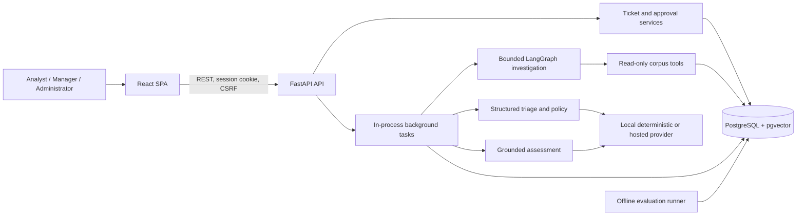

# Architecture

## System Overview

ResolveAI is a single-tenant portfolio application organized as a modular monolith.

The nginx-served React 19 and TypeScript SPA uses same-origin `/api` requests. FastAPI/Pydantic defines contracts, SQLAlchemy and Alembic own persistence, and PostgreSQL stores sessions, tickets, workflow state, synthetic operations, knowledge chunks, vectors, and aggregate evaluation runs. The API is the only application boundary with database access.

## Request And Workflow Path

1. An opaque HTTP-only, SameSite=Lax cookie identifies a database-backed session. State-changing requests also present the session CSRF token.
2. RBAC distinguishes Support Analyst, Manager, and Administrator. High-impact recommendation decisions and ticket audit views require Manager or Administrator; administrator health has the narrowest role gate.
3. Ticket changes, activity entries, and application audit entries commit transactionally according to service conventions.
4. Analysis, investigation, and assessment requests persist queued state before an in-process background task runs.
5. Provider output is schema-validated. Deterministic application policy assigns priority and evidence confidence.
6. A human must decide a recommendation, review and approve a response, and explicitly resolve or escalate the ticket.

## Trust Boundaries

| Boundary | Trusted behavior | Explicit limitation |
|---|---|---|
| Browser to API | Cookie session, CSRF on mutations, role checks, validation | Local HTTP defaults and demo authentication are not appropriate for untrusted networks |
| Ticket/corpus text | Treated as untrusted data; lengths and schemas bounded | Prompt-injection instructions may still influence a hosted model's allowed output fields |
| Provider adapter | Strict output schemas, timeout, constrained repair, citation subset checks | Hosted mode sends bounded context to a third party and remains nondeterministic |
| Policy layer | Priority and confidence calculations are deterministic code | Confidence is not calibrated probability or measured accuracy |
| Investigation tools | Registered tools are read-only, bounded, and return persisted source IDs | Synthetic telemetry and incidents are not live infrastructure observations |
| Human decision | Named actor and reason recorded for decisions | Application audit rows are append-only by convention, not tamper-evident |
| Resolution | Records an internal workflow outcome | No remediation, ticketing-system integration, notification, or delivery adapter exists |
| Deployment | One local API process, process-local limiter, local database volume | No tenant isolation, durable queue, HA, compliance certification, or at-rest encryption certification |

## Deterministic And Hosted Modes

`RESOLVEAI_AI_MODE=local_demo` uses versioned rules, signed-hash embeddings, bounded deterministic planning, grounded synthetic inference, and response templates. Reproducibility is its purpose; it is not an LLM simulation or production quality claim.

`openai_compatible` calls a configured `/chat/completions` endpoint. Depending on the workflow, the provider receives bounded ticket title/description/context, normalized evidence, accepted guidance, and limitations. API keys are not persisted, but provider processing and retention are governed by the configured service. Priority remains deterministic and assessment citations must reference supplied evidence IDs.

## Failure And Durability Model

Database transactions protect persisted state transitions, and failed workflows retain safe status/error codes. Background tasks run inside the API process after the response and are not durable: process termination can leave work queued or running. Retries are explicit. A production design would require a durable queue, idempotent workers, shared rate limiting, centralized secrets, TLS, monitoring, backups, tenant authorization, and tamper-resistant audit retention.

## Component Documentation

- [API](api.md)
- [AI design](ai-design.md)
- [RAG](rag-architecture.md)
- [Investigation](investigation-workflow.md)
- [Root-cause assessment](root-cause-analysis.md)
- [Human approval](human-approval.md)
- [Data model](data-model.md)
- [Evaluation](evaluation.md)
