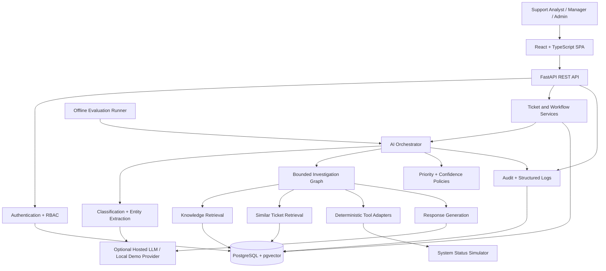
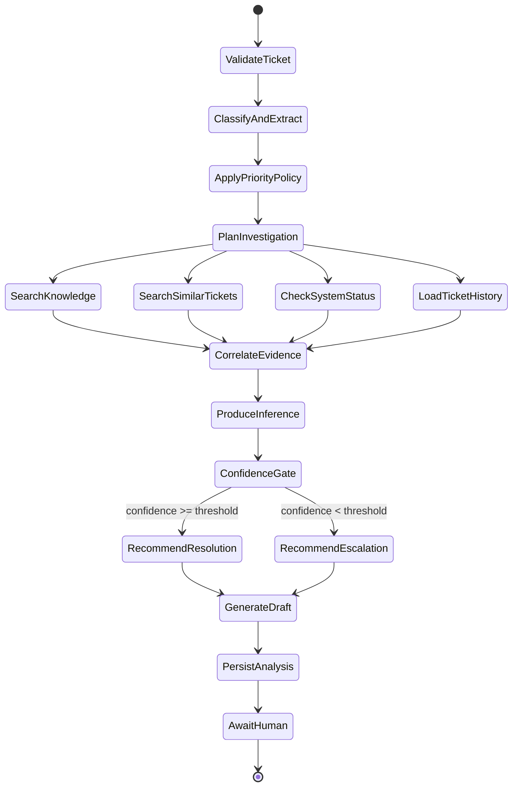

# ResolveAI Implementation Plan

> **Historical planning document:** this file records the original phased design and contains superseded future-tense statements. It is not the authority for the current API, architecture, security posture, or behavior. Use [Architecture](architecture.md), [API](api.md), [AI design](ai-design.md), [Setup](setup.md), and [Evaluation results](evaluation-results.md) for the implemented system.

## 1. Purpose and Current State

ResolveAI is a portfolio-grade IT support copilot that demonstrates an auditable workflow from ticket intake through human-approved resolution. It is not a chatbot and must not imply that an AI recommendation is a confirmed diagnosis or an action that has already occurred.

Repository state at planning time:

- The Git repository is initialized on `main` with no commits.
- No application code, configuration, tests, or infrastructure currently exists.
- The requested React, FastAPI, PostgreSQL, pgvector, and Docker stack has no existing compatibility constraints.

At planning time, this document served as the implementation contract and required review before Phase 1.

## 2. Scope and Technical Decisions

### Selected stack

| Area | Selection | Reason |
|---|---|---|
| Frontend | React, TypeScript, Vite | Familiar, fast development, strong type support, simple container build |
| Routing/data | React Router, TanStack Query | Explicit page routing and reliable server-state handling |
| UI | Tailwind CSS with accessible headless primitives | Consistent enterprise UI without adopting a visually generic component kit wholesale |
| Charts | Recharts | Sufficient for dashboard and analytics, with a small API surface |
| Backend | Python 3.12, FastAPI, Pydantic v2 | Typed API contracts, validation, dependency injection, generated OpenAPI |
| Persistence | PostgreSQL 16, SQLAlchemy 2, Alembic | Relational integrity, migrations, mature tooling |
| Vector search | pgvector | Keeps metadata, access control, and vectors in one database for this scale |
| AI orchestration | Plain services plus LangGraph for investigation only | Avoids agent overhead for deterministic CRUD, policy, and validation work |
| Embeddings | Provider interface; local sentence-transformers by default | Runs without paid services; hosted embeddings can be enabled later |
| LLM | Provider interface; optional hosted provider plus deterministic demo provider | The demo remains operable without keys and clearly labels non-LLM output |
| Testing | Pytest, Vitest, Testing Library, Playwright | Unit, API, component, and critical end-to-end coverage |
| Quality | Ruff, mypy, ESLint, Prettier | Fast, recognizable static checks |
| Infrastructure | Docker Compose | One-command local environment with independently testable services |

### Deliberate constraints

- Begin as a modular monolith, not microservices. Frontend, API, worker-like AI modules, and database remain cleanly separated without distributed-system overhead.
- Use REST APIs. The product workflows do not require GraphQL.
- Keep PostgreSQL as the only stateful service. A separate vector database is unnecessary for the expected corpus size.
- Store files as metadata in the MVP; binary upload/storage is out of scope until a secure object-store design is required.
- Never depend on a paid service for the recruiter demo. Hosted LLM behavior is an optional enhancement, not a startup requirement.
- Do not implement autonomous remediation. ResolveAI recommends actions and records explicit human decisions.

## 3. System Architecture



### Component boundaries

#### Frontend

- Public landing page and demo entry.
- Authenticated application shell with role-aware navigation.
- Dashboard, tickets, ticket details, analytics, and admin health views.
- Explicit loading, empty, degraded, and error states.
- Evidence drawers and investigation timeline expose auditable factors, never hidden chain-of-thought.

#### FastAPI application

- API routers only translate HTTP requests and responses.
- Service modules own business workflows and transaction boundaries.
- Repositories own persistence queries.
- Pydantic schemas validate every external and AI-generated payload.
- Dependencies provide authenticated user, authorization checks, database sessions, provider clients, and request context.

#### AI modules

- Classification and entity extraction are bounded structured-output calls.
- Priority is a deterministic policy using validated impact, scope, urgency, and outage signals. The model may recommend inputs but cannot bypass policy constraints.
- Retrieval is deterministic search and ranking over stored chunks and historical tickets.
- LangGraph coordinates a small, inspectable investigation state machine and tool selection.
- Root-cause output contains separate evidence, inference, recommendation, confidence, and limitations fields.
- Response generation cannot send or resolve a ticket.

#### Persistence

- Transactional data uses normalized relational columns.
- JSONB is limited to variable provider metadata, extracted entities, evidence snapshots, and event payloads where a fixed relational shape would be artificial.
- Vector columns are used only for knowledge chunks and historical ticket search.
- Audit entries are append-only through application permissions.

### Request and observability flow

1. Middleware creates or accepts a safe `X-Request-ID`.
2. Authentication resolves the user and role.
3. Authorization checks the requested operation.
4. The route invokes a service with a database transaction.
5. Structured logs include request ID, user ID, ticket ID when relevant, operation, duration, outcome, and error code.
6. AI tool calls record tool name, sanitized inputs, source identifiers, duration, and outcome.
7. User-visible errors use stable codes and safe messages; traces remain server-side.

## 4. Data Model

All primary keys use UUIDs except human-readable ticket numbers. Timestamps use timezone-aware UTC values. Mutable tables include `created_at` and `updated_at` unless noted.

### Identity and access

#### `users`

- `id`: UUID primary key
- `email`: case-insensitive unique email
- `display_name`: text
- `password_hash`: text, nullable only for future external identity providers
- `role`: enum `support_analyst | manager | administrator`
- `is_demo`: boolean
- `is_active`: boolean
- `last_login_at`: timestamp nullable

Demo credentials are seeded from non-secret development configuration. Production-like environments require an explicit bootstrap mechanism and never embed a reusable password in source.

### Tickets and workflow

#### `tickets`

- `id`: UUID primary key
- `ticket_number`: generated unique integer displayed as `RAI-1042`
- `title`: varchar(200)
- `description`: text
- `requester_name`: varchar(120)
- `requester_department`: varchar(120) nullable
- `location`: varchar(120) nullable
- `device`: varchar(120) nullable
- `application`: varchar(120) nullable
- `attachment_metadata`: JSONB nullable, validated list of filename/content type/size only
- `category`: enum, nullable before triage
- `priority`: enum `p1 | p2 | p3 | p4`, nullable before triage
- `priority_overridden`: boolean
- `priority_override_reason`: text nullable
- `status`: enum `new | analyzing | awaiting_approval | in_progress | resolved | escalated | failed`
- `assigned_to_id`: foreign key to `users`, nullable
- `created_by_id`: foreign key to `users`
- `resolved_at`: timestamp nullable
- `escalated_at`: timestamp nullable

#### `ticket_events`

- `id`: UUID primary key
- `ticket_id`: foreign key
- `actor_user_id`: foreign key nullable for system events
- `event_type`: enum such as `created`, `analysis_started`, `analysis_completed`, `comment_added`, `response_generated`, `response_approved`, `resolved`, `escalated`
- `summary`: short human-readable text
- `payload`: JSONB containing validated event-specific details
- `created_at`: timestamp; events are immutable

#### `ticket_responses`

- `id`: UUID primary key
- `ticket_id`: foreign key
- `analysis_id`: foreign key nullable
- `draft_body`: text
- `final_body`: text nullable
- `status`: enum `draft | approved | rejected | sent`
- `generated_by`: enum `ai | human`
- `approved_by_id`: foreign key nullable
- `approved_at`: timestamp nullable
- `sent_at`: timestamp nullable; populated only by a real send adapter

In the MVP, approval records the response as approved. The UI must not claim it was sent unless a send adapter actually succeeds.

### AI analysis and evidence

#### `ai_analyses`

- `id`: UUID primary key
- `ticket_id`: foreign key
- `workflow_version`: varchar
- `provider`: varchar
- `model`: varchar nullable
- `mode`: enum `hosted | local_demo`
- `status`: enum `queued | running | completed | failed | timed_out`
- `category`: enum
- `category_confidence`: decimal
- `recommended_priority`: enum
- `validated_priority`: enum
- `entities`: JSONB validated against `ExtractedEntities`
- `root_cause_inference`: text nullable
- `confidence`: decimal from 0 to 1
- `recommendation`: text nullable
- `limitations`: JSONB list of strings
- `started_at`, `completed_at`: timestamps
- `duration_ms`: integer nullable
- `error_code`: varchar nullable

#### `analysis_evidence`

- `id`: UUID primary key
- `analysis_id`: foreign key
- `evidence_type`: enum `ticket_fact | knowledge_chunk | similar_ticket | system_status | ticket_history`
- `source_id`: stable source identifier
- `title`: text
- `excerpt`: text
- `relevance_score`: decimal nullable
- `supports`: text describing the auditable decision factor
- `observed_at`: timestamp nullable
- `display_order`: integer

#### `investigation_steps`

- `id`: UUID primary key
- `analysis_id`: foreign key
- `step_key`: stable machine key
- `label`: safe user-facing description
- `tool_name`: varchar nullable
- `status`: enum `started | completed | skipped | failed`
- `source_count`: integer nullable
- `duration_ms`: integer nullable
- `created_at`: timestamp

These rows power “Show Me Why” without storing private chain-of-thought.

#### `recommendations`

- `id`: UUID primary key
- `analysis_id`: foreign key
- `action_type`: enum `troubleshoot | request_information | high_impact | escalate`
- `title`: text
- `instructions`: text
- `requires_approval`: boolean
- `status`: enum `proposed | approved | modified | rejected | completed`
- `decided_by_id`: foreign key nullable
- `decision_reason`: text nullable
- `decided_at`: timestamp nullable

### Knowledge and similarity

#### `knowledge_documents`

- `id`: UUID primary key
- `slug`: unique text
- `title`: text
- `category`: enum
- `source_path`: text
- `version`: text
- `checksum`: text
- `is_active`: boolean
- `ingested_at`: timestamp nullable

#### `knowledge_chunks`

- `id`: UUID primary key
- `document_id`: foreign key
- `chunk_index`: integer
- `heading`: text nullable
- `content`: text
- `token_count`: integer
- `embedding`: vector with dimension fixed by configured embedding provider
- unique constraint on `(document_id, chunk_index)`

#### `historical_tickets`

- `id`: UUID primary key
- `external_number`: unique text
- `title`, `description`, `resolution`: text
- `category`, `priority`, `status`: enums
- `opened_at`, `resolved_at`: timestamps
- `resolution_minutes`: integer nullable
- `embedding`: vector
- `dataset_version`: text

### Operations and evaluation

#### `system_status`

- `id`: UUID primary key
- `service`: unique enum
- `status`: enum `operational | degraded | outage | maintenance`
- `availability`: decimal
- `active_incidents`: integer
- `incident_summary`: text nullable
- `scenario_key`: varchar
- `observed_at`: timestamp

#### `audit_logs`

- `id`: UUID primary key
- `request_id`: varchar
- `actor_user_id`: foreign key nullable
- `ticket_id`: foreign key nullable
- `action`: stable action key
- `resource_type`, `resource_id`: varchar
- `outcome`: enum `success | denied | failure`
- `details`: sanitized JSONB
- `created_at`: timestamp; append-only

#### `evaluation_runs`

- `id`: UUID primary key
- `dataset_version`, `workflow_version`, `provider`, `model`: varchar
- `status`: enum
- `sample_count`: integer
- `metrics`: JSONB with documented metric schema
- `started_at`, `completed_at`: timestamps

### Important indexes and constraints

- B-tree indexes on ticket status, priority, category, assignee, and creation time.
- GIN or trigram index for ticket title/description search if PostgreSQL full-text search is insufficient.
- HNSW pgvector indexes after enough rows exist to justify them; exact search is acceptable during early development.
- Check constraints for confidence and relevance values between 0 and 1.
- Check constraints that override reasons exist when priority is overridden.
- Foreign-key behavior prevents deletion of audit history and referenced analyses.
- Idempotency guard prevents multiple concurrent analyses for the same ticket unless an explicit reanalysis is requested.

### Synthetic enterprise data model

The demo dataset is one coherent fictional enterprise, not independent random records. `scripts/generate_demo_data.py` will use a fixed seed and configurable counts, with defaults of 250 users, 1,000 tickets, 25 major incidents, 100 knowledge articles, 15 applications, and 10 locations.

Core generated entities:

- `synthetic_users`: fictional identity, department, manager relationship, location, device, operating system, and support tier. These are distinct from application login users.
- `locations`: office network, synthetic subnet, Wi-Fi environment, VPN gateway, and DNS service identifiers for Dallas, Austin, New York, Chicago, Atlanta, Seattle, Denver, Phoenix, Boston, and San Francisco.
- `applications`: fictional owner, criticality, environment, normal availability, and dependencies. Names include FinanceHub, HRConnect, PayrollPro, Customer360, and other explicitly fictional systems.
- `incidents`: time window, affected locations/users/applications, root cause, resolution, and hidden ground truth.
- `historical_tickets`: varied symptoms, category/subcategory, priority, assignment, resolution, linked incident, related knowledge, and related tickets.
- `telemetry_records`: timestamped service/location availability, latency, throughput where relevant, and error rate.
- `synthetic_logs`: timestamp, synthetic host, severity, safe message, service, location, and incident link.

Relationship rules:

1. Application dependencies determine which incidents can affect an application.
2. Incident location and time windows determine eligible users, tickets, telemetry anomalies, and logs.
3. Tickets describe symptoms rather than exposing the incident root cause directly.
4. Related tickets share explainable factors such as location, application dependency, time window, or failure signature.
5. Telemetry anomalies and log events occur inside incident windows with realistic lead-in and recovery behavior.
6. Resolutions are selected from category-specific variants and remain consistent with incident outcomes.
7. Ground truth is stored separately from normal API serializers and is available only to evaluation tooling and administrator-level evaluation summaries.

The generator writes versioned source files beneath `data/` and can seed PostgreSQL idempotently. `scripts/validate_demo_data.py` will verify unique IDs, foreign keys, category values, timestamps, dependency references, incident links, knowledge integrity, and expected counts. Generated data and UI surfaces will state that all enterprise information is synthetic.

### Incident correlation model

At least 20 incident templates will cover DNS, VPN authentication, Microsoft 365 authentication, Wi-Fi controller, application dependency, database, file storage, and network packet-loss failures. Templates create varied ticket language while preserving hidden relationships.

The primary curated scenario is:

- Dallas DNS degradation affects PayrollPro and other internal applications during a fixed window.
- VPN authentication remains healthy, while DNS telemetry has elevated latency/error rate.
- Synthetic DNS logs show internal-zone resolution failures.
- Multiple tickets report different symptoms during the same interval.
- Knowledge articles explain how to distinguish VPN connectivity from internal name-resolution failure.

This gives retrieval and investigation meaningful evidence to correlate without exposing the answer in ticket text.

## 5. API Contracts

All endpoints are under `/api/v1`. JSON uses snake_case. Error responses follow:

```json
{
  "error": {
    "code": "ticket_not_found",
    "message": "The requested ticket could not be found.",
    "request_id": "req_...",
    "details": []
  }
}
```

List responses include `items`, `page`, `page_size`, `total`, and `has_next`. Mutations that can be retried accept an `Idempotency-Key` header.

### Authentication

| Method | Path | Purpose | Access |
|---|---|---|---|
| POST | `/auth/login` | Authenticate and set secure session cookie | Public |
| POST | `/auth/demo` | Start a clearly labeled demo session | Public |
| POST | `/auth/logout` | Invalidate session | Authenticated |
| GET | `/auth/me` | Return current user and role | Authenticated |

Use server-managed, HTTP-only, `Secure` in production, `SameSite=Lax` session cookies. State-changing requests require CSRF protection. Passwords use Argon2id.

### Tickets

| Method | Path | Purpose | Access |
|---|---|---|---|
| POST | `/tickets` | Create a ticket | Analyst+ |
| GET | `/tickets` | Search/filter/paginate tickets | Analyst+ |
| GET | `/tickets/{ticket_id}` | Ticket detail and current workflow summary | Analyst+ |
| PATCH | `/tickets/{ticket_id}` | Update permitted ticket fields | Analyst+ |
| POST | `/tickets/{ticket_id}/assign` | Assign ticket | Analyst+ |
| POST | `/tickets/{ticket_id}/priority-override` | Override AI priority with reason | Analyst+ |
| GET | `/tickets/{ticket_id}/events` | Activity timeline | Analyst+ |
| GET | `/tickets/{ticket_id}/audit` | Ticket audit entries | Manager+ |

Ticket creation request:

```json
{
  "title": "VPN connected but internal applications unavailable",
  "description": "Cisco Secure Client shows connected, but Payroll is unreachable.",
  "requester_name": "Alex Morgan",
  "requester_department": "Finance",
  "location": "Dallas",
  "device": "Laptop",
  "application": "Payroll",
  "attachment_metadata": []
}
```

### Analysis and investigation

| Method | Path | Purpose | Access |
|---|---|---|---|
| POST | `/tickets/{ticket_id}/analyses` | Start analysis; returns `202` and analysis ID | Analyst+ |
| GET | `/tickets/{ticket_id}/analyses/latest` | Latest analysis summary | Analyst+ |
| GET | `/analyses/{analysis_id}` | Full structured analysis | Analyst+ |
| GET | `/analyses/{analysis_id}/evidence` | Source-backed evidence | Analyst+ |
| GET | `/analyses/{analysis_id}/timeline` | Safe investigation steps | Analyst+ |
| POST | `/analyses/{analysis_id}/retry` | Retry a failed analysis | Analyst+ |

The analysis response separates facts and inferences:

```json
{
  "id": "uuid",
  "status": "completed",
  "classification": {
    "category": "vpn",
    "category_confidence": 0.94,
    "recommended_priority": "p3",
    "validated_priority": "p3",
    "entities": {
      "user": "Alex Morgan",
      "location": "Dallas",
      "application": "Payroll",
      "device": "Laptop",
      "issue_type": "vpn",
      "affected_scope": "individual",
      "urgency": "medium"
    }
  },
  "root_cause": {
    "kind": "inference",
    "summary": "Internal DNS resolution failure",
    "confidence": 0.91,
    "recommendation": "Flush the local DNS cache and reconnect the VPN.",
    "limitations": ["No direct device telemetry was available."],
    "requires_escalation": false
  },
  "evidence": [],
  "mode": "local_demo"
}
```

### Responses, approval, and resolution

| Method | Path | Purpose | Access |
|---|---|---|---|
| POST | `/tickets/{ticket_id}/responses` | Generate or create a draft | Analyst+ |
| PATCH | `/responses/{response_id}` | Edit draft | Analyst+ |
| POST | `/responses/{response_id}/approve` | Approve final body | Analyst+ |
| POST | `/responses/{response_id}/reject` | Reject with reason | Analyst+ |
| POST | `/tickets/{ticket_id}/resolve` | Resolve after explicit confirmation | Analyst+ |
| POST | `/tickets/{ticket_id}/escalate` | Escalate with destination and reason | Analyst+ |
| POST | `/recommendations/{id}/decision` | Approve, modify, or reject recommendation | Analyst+; policy may require Manager+ |

Approval is never combined with generation. Resolve and escalate endpoints validate current state and write ticket event plus audit log atomically.

### Knowledge, status, analytics, and administration

| Method | Path | Purpose | Access |
|---|---|---|---|
| GET | `/knowledge/search` | Search active knowledge chunks | Analyst+ |
| GET | `/knowledge/documents/{id}` | Document metadata and permitted excerpts | Analyst+ |
| GET | `/tickets/{ticket_id}/similar` | Similar historical incidents | Analyst+ |
| GET | `/system-status` | Current deterministic service statuses | Analyst+ |
| GET | `/analytics/overview` | Operational dashboard aggregates | Analyst+ |
| GET | `/analytics/ai-performance` | Clearly labeled measured/synthetic metrics | Manager+ |
| GET | `/health/live` | Process liveness | Public, no internals |
| GET | `/health/ready` | Dependency readiness | Container/orchestrator |
| GET | `/admin/health` | Sanitized component health and latency | Administrator |
| GET | `/admin/audit` | Filtered audit records | Administrator |

FastAPI generates OpenAPI. CI verifies that the schema can be generated and optionally exports it to `docs/openapi.json` for version review.

## 6. AI Workflow

### Responsibility split

| Mechanism | Responsibilities |
|---|---|
| Deterministic code | Input validation, authorization, priority policy, confidence threshold, workflow state changes, source IDs, audit records, status simulator, approval gates |
| Structured LLM calls | Category signal, entity extraction, query formulation, evidence-grounded synthesis, response wording |
| RAG | Knowledge chunk retrieval with exact source metadata and excerpts |
| Semantic search | Similar historical ticket ranking |
| LangGraph | Bounded investigation routing, retries, timeouts, and state checkpoints |
| Human | Priority override, consequential action decision, final response approval, resolution or escalation |

### Validated schemas

Model output is parsed into strict Pydantic models with forbidden extra fields:

- `ClassificationSignal`
- `ExtractedEntities`
- `InvestigationPlan`
- `EvidenceAssessment`
- `RootCauseInference`
- `ResponseDraft`

Invalid output gets one constrained repair attempt. A second failure records `invalid_ai_response`, preserves retrieved evidence, and directs the analyst to manual review. Raw provider output is not sent to the browser or logged by default.

### Priority policy

The model extracts policy inputs but deterministic code assigns the final recommendation:

1. P1: confirmed major outage, critical production service unavailable, or broad business impact with no workaround.
2. P2: multiple users or important business function affected; workaround absent or limited.
3. P3: individual user with meaningful productivity impact.
4. P4: low-impact request, information request, or minor inconvenience.

Ambiguous scope cannot produce P1 solely from urgency language. Security indicators can force an escalation recommendation without falsely labeling an outage. A human override requires a reason and creates an audit event.

### Investigation graph



The planner selects only from allowed tools and has a maximum tool-call count. Category-specific defaults guarantee useful evidence collection even if planning fails. Tools return structured results and cannot mutate external systems.

### Agent tool contracts

All investigation tools are read-only, typed, independently testable, and return source identifiers:

| Tool | Purpose | Key inputs | Result |
|---|---|---|---|
| `search_knowledge_base` | Retrieve troubleshooting guidance | query, category, top_k | ranked chunks with article IDs and excerpts |
| `search_similar_tickets` | Retrieve comparable resolved cases | ticket text, category, top_k | ticket IDs, similarity, symptoms, resolution |
| `get_ticket_history` | Load prior visible interactions | ticket ID | ordered ticket events |
| `get_system_status` | Read deterministic current status | service, location, timestamp | operational state and active incidents |
| `get_telemetry` | Inspect service measurements | service, location, time range | bounded telemetry series and anomaly summary |
| `search_logs` | Find relevant synthetic log events | service, location, time range, terms | sanitized log excerpts with source IDs |
| `get_related_incident` | Inspect incident correlation candidates | service/location/application/time | public incident facts, never hidden ground truth |
| `generate_customer_response` | Draft grounded customer wording | approved evidence and recommendation | validated draft only; no send side effect |

Prompt or ticket content cannot introduce new tools, alter tool permissions, or request hidden ground truth. Retrieved content is treated as untrusted data and cannot override system instructions.

### Retrieval design

1. Ingest versioned Markdown knowledge documents.
2. Normalize headings while retaining source path and title.
3. Chunk by semantic section with modest overlap, recording checksum and token count.
4. Embed chunks through the configured provider.
5. Retrieve semantic candidates, optionally combine with PostgreSQL full-text rank, and deduplicate by document section.
6. Pass only retrieved excerpts and source IDs to synthesis.
7. Persist the exact evidence snapshot used by an analysis so later document updates do not rewrite history.

No citation may be displayed unless its source ID maps to a persisted chunk or deterministic tool result.

### Similar-ticket retrieval

- Generate 500-1,000 reproducible synthetic historical tickets from documented scenario templates.
- Use a fixed random seed and include a dataset version.
- Embed title plus description; return category, resolution, date, and resolution time from relational columns.
- Combine vector similarity with category agreement and recency only when evaluation demonstrates improvement.
- Clearly label all historical incidents as synthetic demo data.

### Confidence and escalation

Confidence is a calibrated product signal, not an unqualified model self-rating. Initial confidence combines documented features such as retrieval relevance, agreement among evidence sources, contradictory evidence, and missing inputs. The formula is versioned and later calibrated against the evaluation dataset.

- Default escalation threshold: `0.70`, configurable by environment.
- Below threshold: show “AI confidence is low. Human investigation recommended.”
- Contradictory service status or weak retrieval lowers confidence.
- A high confidence value still labels root cause as probable until a human confirms resolution.

### Provider modes and degraded behavior

#### `hosted`

Uses an explicitly configured LLM API. Keys exist only in environment variables. Provider timeouts, rate limits, and malformed output map to stable error codes.

#### `local_demo`

Uses deterministic scenario classification, policy rules, local embeddings, retrieval, and templated grounded synthesis. The interface clearly labels this as demo-mode analysis rather than pretending a hosted LLM was called. This mode supports all five recruiter scenarios without network access.

If the LLM is unavailable, retrieval and deterministic evidence remain visible. The application offers retry or manual investigation rather than fabricating a completed analysis.

## 7. Security and Trust Baseline

- Validate all requests and AI outputs; enforce reasonable length and attachment-metadata limits.
- Use Argon2id password hashing, server-managed sessions, CSRF protection, and role checks at service boundaries.
- Apply per-IP limits to public auth routes and per-user limits to analysis/generation routes.
- Configure CSP, HSTS in production, frame denial, MIME sniffing protection, and restrictive CORS.
- Use parameterized SQL through SQLAlchemy and escape rendered user content.
- Keep secrets in environment variables; commit only `.env.example`.
- Avoid logging descriptions, response bodies, passwords, tokens, or raw model prompts by default.
- Record approval, override, resolution, escalation, authorization denial, and admin actions.
- Separate recommendation, evidence, inference, and confirmed human outcome in API and UI language.
- Redact provider errors and never return stack traces to regular users.
- Run dependency and container vulnerability checks in CI without claiming complete security coverage.
- Keep hidden ground truth outside analyst-facing serializers and retrieval indexes.
- Treat knowledge articles, tickets, and logs as untrusted prompt content; delimit them and reject embedded instructions from tool control flow.

### Security model

Trust boundaries are the browser, API, database, AI provider, and generated synthetic-data artifacts. Authentication establishes identity; service-level authorization enforces role and object access even when a route already checked it. The AI orchestrator receives only the minimum ticket and retrieved evidence required for its task. Provider adapters apply timeout, retry, data-minimization, and structured-output policies.

Threats explicitly covered in implementation and tests include broken role authorization, session/CSRF misuse, injection through ticket or knowledge text, fabricated source IDs, replayed state-changing requests, concurrent workflow transitions, unsafe error disclosure, secret leakage, and denial of service through expensive analysis endpoints.

## 8. Evaluation Methodology

The evaluation dataset contains at least 100 versioned cases separated from the demo paths used to tune deterministic rules. Each case stores expected category, priority-policy inputs and outcome, relevant article IDs, incident/root-cause ID when applicable, required evidence types, and acceptable recommendation concepts.

Metrics:

- Category accuracy: exact match plus a confusion matrix.
- Priority accuracy: exact deterministic-policy match, with under-prioritization reported separately.
- Retrieval relevance: recall@k, precision@k, and mean reciprocal rank against expected article IDs.
- Root-cause identification: exact incident/root-cause key match where ground truth exists; unsupported cases are scored separately.
- Evidence grounding: proportion of cited evidence IDs that resolve to retrieved or tool-produced records.
- Recommendation quality: deterministic checks for required concepts, prohibited unsupported actions, escalation behavior, and human-approval language. Any optional model-graded score is reported separately with evaluator model/version and is never the sole metric.
- Operational quality: valid structured-output rate, timeout/failure rate, and latency percentiles.

`python evaluation/run_eval.py` will support local demo mode without keys, emit console and machine-readable reports, record dataset/workflow versions, and return non-zero only for execution errors unless an explicit quality threshold flag is supplied. The product displays only stored measured results and labels synthetic evaluation at the point of use.

## 9. Development Phases and Exit Gates

Each phase ends with tests, startup verification, a result report, and no progression until failures are resolved or explicitly documented and approved.

### Phase 1: Foundation

Deliverables:

- Monorepo directories for `frontend`, `backend`, `docs`, `data`, and `evaluation`.
- React/TypeScript/Vite application with a minimal branded health screen, not feature placeholders.
- FastAPI application with liveness and readiness endpoints.
- PostgreSQL plus pgvector initialization.
- SQLAlchemy/Alembic foundation and an initial connectivity migration if appropriate.
- Dockerfiles and root `docker-compose.yml` for frontend, backend, and database.
- `.env.example`, `.gitignore`, baseline lint/type/test configuration.
- Backend and frontend health tests.

Exit gate:

- `docker compose up --build` starts all services from a clean checkout.
- Frontend loads and reports API readiness.
- API liveness and readiness return the documented responses.
- Database connectivity succeeds and migrations apply.
- Backend and frontend tests, lint, and type checks pass.
- No credentials or keys are committed.

### Phase 2: Authentication, dashboard, and ticket CRUD

- Session authentication, demo login, roles, seed users, CSRF, and authorization tests.
- Application shell and role-aware navigation.
- Ticket tables, migrations, CRUD APIs, validation, search/filter/pagination.
- Dashboard aggregates and recent-ticket table.
- Ticket create/detail pages with responsive loading and error states.
- Audit baseline for authentication and ticket changes.

Exit gate: demo login and ticket CRUD work through UI and API; RBAC denial tests pass.

### Phase 3: Synthetic enterprise environment

- Reproducible configurable generator for users, locations, applications, 1,000 tickets, 25 incidents, 100 knowledge articles, telemetry, and logs.
- Hidden ground truth and coherent incident/ticket/application relationships.
- Category-specific language and resolution variation without manually authored bulk records.
- Validation command with count, foreign-key, uniqueness, timeline, and incident-integrity reporting.
- Synthetic-data disclaimer in generated metadata and relevant UI surfaces.

Exit gate: the same seed produces the same validated dataset; incident relationships and ground truth tests pass.

### Phase 4: Structured triage

- Provider abstraction and deterministic demo provider.
- Strict classification and entity schemas.
- Deterministic priority policy and human override.
- Analysis persistence, status polling, timeouts, and degraded states.
- Unit/evaluation fixtures for categories and priorities.

Exit gate: ticket analysis returns validated category, entities, and policy-controlled priority in both success and failure tests.

### Phase 5: Knowledge ingestion and RAG

- At least 14 realistic, versioned knowledge documents.
- Chunking, checksums, local embeddings, pgvector storage, and ingestion command.
- Hybrid or vector retrieval API with source metadata.
- Knowledge source and excerpt UI.
- Retrieval relevance tests with known queries.

Exit gate: every displayed citation resolves to a persisted source excerpt; ingestion is idempotent.

### Phase 6: Similar tickets, investigation graph, telemetry, and logs

- Reproducible generator for 500-1,000 synthetic historical tickets.
- Similarity ingestion/search and UI.
- LangGraph bounded workflow.
- Read-only knowledge, similar-ticket, history, and deterministic system-status tools.
- Typed telemetry, synthetic-log, and related-incident tools with bounded queries.
- Tool invocation logs, limits, timeout handling, and tests.

Exit gate: all demo scenarios produce traceable tool results with deterministic fallback behavior.

### Phase 7: Root cause, evidence, and “Show Me Why”

- Evidence correlation and versioned confidence calculation.
- Root-cause inference, limitations, recommendation, and confidence gate.
- Evidence cards and safe investigation timeline.
- Low-confidence escalation behavior.
- Tests for contradictory, missing, and weak evidence.

Exit gate: no inference is presented as fact; each supporting item has a valid source.

### Phase 8: Human approval and ticket outcomes

- Grounded response generation and editing.
- Approve/reject/modify recommendation flows.
- Resolve and escalate transitions with atomic audit entries.
- High-impact action warnings and role policy.
- Critical end-to-end workflow test.

Exit gate: no generated response is sent, and no ticket is resolved, without an explicit human action.

### Phase 9: Analytics, evaluation, and observability

- Operational analytics and clearly labeled demo data.
- AI performance metrics backed by stored evaluation runs.
- Versioned dataset with at least 100 expected outcomes.
- `python evaluation/run_eval.py` report for classification, priority, retrieval, and response rubric results.
- Structured logging, request IDs, timings, and admin health page.

Exit gate: metrics identify data source and methodology; evaluation is reproducible.

### Phase 10: Hardening, tests, Docker, and CI

- Expand backend unit/API, frontend component, and Playwright coverage.
- Rate limits, secure headers, error boundaries, dependency failure tests.
- GitHub Actions for lint, types, tests, builds, security checks, and Docker builds.
- Production-oriented container users and health checks.

Exit gate: clean CI passes from a fresh checkout and the full Docker workflow remains reproducible.

### Phase 11: Portfolio polish and documentation

- Refined desktop/mobile/accessibility UX and all demo scenarios.
- Landing page and 90-second demo path.
- README, screenshots, architecture, AI design, evaluation, security, API, and demo script docs.
- Contribution guide, license, security policy, issue templates, and pull request template.
- Final acceptance-criteria walkthrough.

Exit gate: a new user can complete the full acceptance workflow without configuration or undocumented steps.

## 10. Dependency Plan

Dependencies are added in the phase that first uses them rather than front-loading the entire stack.

### Phase 1 runtime

Backend:

- `fastapi`, `uvicorn`
- `pydantic-settings`
- `sqlalchemy`, `asyncpg`, `alembic`
- `pgvector`

Frontend:

- `react`, `react-dom`
- `react-router-dom`
- `@tanstack/react-query`

Development:

- Backend: `pytest`, `pytest-asyncio`, `httpx`, `ruff`, `mypy`
- Frontend: `typescript`, `vite`, `vitest`, Testing Library, `eslint`, `prettier`

### Later phases

- Authentication: `argon2-cffi`; a small maintained session implementation or framework selected after checking current maintenance/security status.
- UI: Tailwind CSS and narrowly selected accessible primitives.
- AI: `langgraph`, provider SDK only when hosted mode is implemented.
- Local embeddings: `sentence-transformers`; model downloaded during explicit data setup or cached in the demo image, with licensing and image-size impact documented.
- Charts: `recharts`.
- E2E: `playwright`.
- Rate limiting: a maintained ASGI-compatible limiter, or a small database-backed policy if Redis is intentionally avoided.

Every new package must have a concrete use, compatible license, active maintenance, and no simpler built-in alternative.

## 11. External Services and Environment

Required local services:

- PostgreSQL 16 with pgvector, supplied by Docker Compose.
- No Redis, separate vector database, object store, or paid API is required for the complete demo path.

Planned environment variables:

- `RESOLVEAI_ENVIRONMENT`, `RESOLVEAI_LOG_LEVEL`, `RESOLVEAI_DATABASE_URL`
- `RESOLVEAI_SESSION_SECRET`, required outside local bootstrap mode
- `RESOLVEAI_CORS_ORIGINS`, `RESOLVEAI_TRUSTED_HOSTS`
- `RESOLVEAI_AI_MODE=local_demo|hosted`
- `RESOLVEAI_LLM_PROVIDER`, `RESOLVEAI_LLM_MODEL`, `RESOLVEAI_LLM_API_KEY`
- `RESOLVEAI_EMBEDDING_PROVIDER`, `RESOLVEAI_EMBEDDING_MODEL`
- `RESOLVEAI_CONFIDENCE_THRESHOLD`, `RESOLVEAI_AI_TIMEOUT_SECONDS`
- `RESOLVEAI_DATASET_SEED`, `RESOLVEAI_DATASET_VERSION`

`.env.example` documents safe local values without containing credentials. Provider-specific variables are added only with the corresponding adapter.

### Assumptions

- The initial deployment is a single-tenant portfolio demo with fictional enterprise data.
- Expected scale is approximately 1,000 tickets and 100 knowledge articles, while schema and pagination avoid hard limits at that size.
- Analysts can view all demo tickets; future tenant/team scoping would require explicit row-level authorization.
- “Approve & Send” remains approval-only until a real delivery adapter exists; product copy must not claim delivery.
- Synthetic telemetry and logs are deterministic observations, not live infrastructure integrations.
- Hosted LLM calls may transmit ticket text and therefore remain opt-in with clear configuration and data handling documentation.

## 12. Implementation Without Paid Services

The following are fully implementable locally:

- React UI, FastAPI, PostgreSQL, pgvector, authentication, RBAC, and audit logs.
- All five deterministic demo scenarios and system statuses.
- Knowledge ingestion and retrieval using open-source local embeddings.
- Synthetic historical tickets and semantic similarity.
- Bounded LangGraph workflow and read-only tools.
- Priority policy, confidence gate, evidence timeline, response templates, and approval workflow.
- Analytics, evaluation, structured logs, testing, Docker, and GitHub Actions.
- OpenAPI documentation and all project documentation.

Optional paid/network functionality:

- Hosted LLM classification and generation.
- Hosted embedding provider.
- Actual email/ticket-system delivery and enterprise telemetry integrations.
- Managed database, tracing, log aggregation, and deployment hosting.

These optional integrations will use interfaces/adapters and must not block local startup. The UI and docs will identify which provider mode produced each analysis.

## 13. Risks and Mitigations

| Risk | Impact | Mitigation |
|---|---|---|
| Scope is too large for a polished portfolio project | Broad but shallow implementation | Enforce phase gates; prioritize the five complete demo scenarios and acceptance workflow before secondary polish |
| Hosted AI is unavailable, slow, or costly | Demo failure | Deterministic local demo provider, strict timeouts, retry/manual states, no key required |
| Local embedding model increases image size/startup time | Poor recruiter setup experience | Pin a compact model, cache deliberately, document size, and provide pre-ingested demo data only if reproducibility is retained |
| Synthetic metrics appear misleading | Loss of trust | Label synthetic data at point of use and include dataset/workflow versions and methodology |
| Hallucinated citations or diagnoses | Unsafe, non-credible product | Permit only persisted source IDs; separate inference from evidence; validate output; lower confidence on unsupported claims |
| Arbitrary priority assignment | Incorrect triage | Deterministic priority matrix and tested override workflow |
| Agent complexity obscures behavior | Fragile workflow | Use LangGraph only for bounded investigation with allowed tools, step caps, timeouts, and safe fallbacks |
| Concurrent analysis or state transitions race | Duplicate or invalid outcomes | Transactions, state-machine validation, idempotency keys, and active-analysis constraints |
| Demo auth is mistaken for production auth | Security credibility issue | Clearly document portfolio scope while implementing secure hashing, cookies, CSRF, and RBAC correctly |
| Sensitive ticket text enters logs or providers | Privacy exposure | Data minimization, sanitized structured logs, explicit provider configuration, no raw payload logging |
| Evaluation quality is subjective | Inflated or unstable claims | Separate deterministic metrics from rubric-based response evaluation and report sample counts and limitations |
| Docker health depends on startup ordering | Intermittent startup | Real health checks, dependency readiness, migration step, and clean-start CI test |
| Accessibility/mobile work is postponed | Polished desktop-only demo | Include responsive and accessibility checks in every UI phase, not only final polish |
| Synthetic relationships are internally inconsistent | Investigation becomes trivial or misleading | Generate from incident/application dependency rules and run referential/timeline validation for every dataset build |
| Ground truth leaks into normal retrieval | Artificially inflated root-cause scores | Separate ground-truth files/tables and exclude them from analyst serializers and vector indexes |
| Prompt injection in synthetic or user-authored content | Tool or policy manipulation | Treat retrieved content as data, use fixed tool allowlists, validate arguments/results, and never expose mutation tools to the investigation graph |

## 14. Verification Strategy

### Per change

- Run focused unit tests for touched modules.
- Run formatter, lint, and type checks for the relevant application.
- Verify migrations upgrade from a clean database and do not silently destroy data.

### Per phase

- Run all backend and frontend tests available at that phase.
- Build both applications.
- Start the Docker Compose stack from a clean state.
- Exercise the phase’s primary workflow through public APIs and, when applicable, the UI.
- Inspect logs for secrets, stack traces, and avoidable errors.
- Report implemented items, passing/failing checks, known limitations, and remaining phases.

### Final critical path

```text
Demo login
  -> create ticket
  -> analyze
  -> review classification and entities
  -> inspect knowledge, similar tickets, and status evidence
  -> inspect probable root cause and confidence
  -> open Show Me Why
  -> generate and edit response
  -> approve
  -> resolve or escalate
  -> verify activity and audit records
  -> view analytics and measured evaluation labels
```

## 15. Initial Directory Layout

```text
ResolveAI Project/
├── frontend/
│   ├── src/
│   │   ├── app/
│   │   ├── components/
│   │   ├── features/
│   │   ├── pages/
│   │   └── services/
│   └── tests/
├── backend/
│   ├── app/
│   │   ├── api/
│   │   ├── core/
│   │   ├── models/
│   │   ├── repositories/
│   │   ├── schemas/
│   │   ├── services/
│   │   ├── ai/
│   │   ├── rag/
│   │   └── tools/
│   ├── migrations/
│   └── tests/
├── data/
│   ├── users/
│   ├── locations/
│   ├── applications/
│   ├── incidents/
│   ├── knowledge/
│   ├── tickets/
│   ├── telemetry/
│   ├── logs/
│   └── evaluation/
├── scripts/
│   ├── generate_demo_data.py
│   └── validate_demo_data.py
├── docs/
├── evaluation/
├── .github/
│   └── workflows/
├── docker-compose.yml
├── .env.example
├── .gitignore
└── README.md
```

Feature-specific frontend code stays together under `features`; backend modules remain layered because API, business logic, persistence, and AI providers have materially different trust boundaries.

## 16. Review Decisions Before Phase 1

The following defaults are proposed for approval:

1. Use a modular monolith with React/Vite and FastAPI rather than microservices.
2. Use PostgreSQL with pgvector rather than a separate vector database.
3. Make deterministic `local_demo` mode the zero-configuration default and hosted LLM mode optional.
4. Treat “Approve” as approval only; do not display “sent” without a real delivery adapter.
5. Implement session-cookie authentication rather than storing bearer tokens in browser storage.
6. Reserve LangGraph for the bounded investigation workflow beginning in Phase 6.
7. Complete only Phase 1 after this plan is reviewed, then stop and report its verification results.
