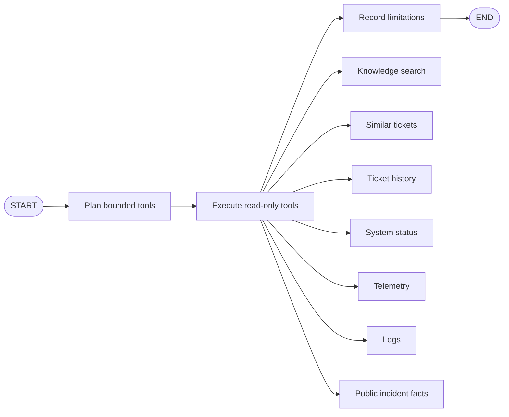

# Bounded Investigation Workflow

## Purpose

Phase 6 turns structured triage into an auditable evidence-collection workflow. LangGraph coordinates deterministic planning, bounded read-only tool execution, and finalization. The workflow does not infer a root cause or recommend an action.

## Operational Corpus

`python -m app.demo.ingest` validates the Phase 3 manifest and source checksums, rejects evaluation paths, parses strict Pydantic rows, embeds historical ticket text, and imports:

| Entity | Default count |
|---|---:|
| Locations | 10 |
| Applications | 15 |
| Historical tickets | 1,000 |
| Public incidents | 25 |
| Telemetry observations | 10,800 |
| Synthetic logs | 2,767 |

The import is transactional and keyed by dataset version plus manifest checksum. Re-running an unchanged corpus verifies database counts and performs no writes. Operational ingestion never reads `data/evaluation/ground_truth.json`.

Source IDs are stable composites derived from dataset and source fields. Multiple dataset versions can coexist because uniqueness is scoped by dataset version.

## Similar Tickets

Historical ticket title and description are embedded with `local-hash-v1` and stored in pgvector. Retrieval uses exact cosine candidates plus lexical Jaccard overlap, deterministic ordering, and only resolved/closed tickets with actual resolution text.

The API returns source ticket ID, symptoms, category, priority, resolution, resolution time, similarity, and related incident ID. Similarity is a retrieval score, not diagnostic confidence.

## Planner

The planner always selects knowledge search, similar-ticket search, and ticket history. Category and ticket signals add only relevant service tools. For example:

- VPN plus unavailable internal services: VPN and DNS status, telemetry, and logs.
- Microsoft 365/Outlook: Microsoft 365 observations.
- Chicago Wi-Fi: Wi-Fi observations.
- Password/MFA/account lockout: Active Directory observations.
- Application outage: matching application observations when available.

Plans are deduplicated and capped at ten invocations. Ticket text cannot introduce tool names or mutation capabilities.

## Read-Only Tools

Each tool validates text, time windows, and result limits. Results include stable source IDs and safe input summaries. Ticket title, description, and search query are removed from persisted tool inputs to avoid duplicating sensitive text.

System state is deterministic:

- Outage: availability below 80% or error rate at least 20%.
- Degraded: availability below 99%, latency at least 500 ms, or error rate at least 2%.
- Operational: none of the above.

An individual tool failure becomes a failed step and a visible limitation while remaining tools continue. Database failures remain fatal so the workflow cannot present an incompletely persisted result as complete.

## Synthetic Reference Time

Normal tickets use their creation time. Curated demo scenarios map only from public ticket/service/location/application facts to the midpoint of a matching public synthetic incident. The run stores `reference_basis=curated_demo_scenario`, and the UI labels it **Curated synthetic reference time**.

The primary Dallas VPN/PayrollPro scenario maps to public incident `INC-0001`. At that reference time, VPN observations remain operational while DNS telemetry is degraded and synthetic logs contain a PayrollPro lookup timeout.

## Persistence

An investigation stores queued/running/completed/failed/timed-out lifecycle state, selected analysis, requester, reference time, safe plan, duration, and ordered steps. Each step stores its public label, tool, sanitized inputs, status, source count, duration, and result snapshot.

Starting, completing, retrying, timing out, and failing also create ticket events and audit records. The UI polls only queued/running runs.

## Safety Boundary

- No mutation tools are registered.
- No hidden chain-of-thought is generated or stored.
- Ground truth is neither imported nor queryable.
- Tool results contain observations, not conclusions.
- The UI explicitly states that root-cause inference and recommendations are not generated in Phase 6.
- Source retrieval failures are shown as limitations rather than fabricated evidence.

## APIs

- `GET /api/v1/tickets/{ticket_id}/similar`
- `POST /api/v1/tickets/{ticket_id}/investigations`
- `GET /api/v1/tickets/{ticket_id}/investigations/latest`
- `GET /api/v1/investigations/{investigation_id}`
- `POST /api/v1/investigations/{investigation_id}/retry`

All endpoints require authentication; mutations also require CSRF protection.

## Production Evolution

The current portfolio deployment runs background work in the API process. A multi-instance production deployment would move investigation jobs to a durable queue, add distributed tracing, and retain the same persisted state machine and idempotent tool contracts.
